<div align="center">

# 👋 Hi, I'm Rajan Kumar Jha

### Backend & Platform Engineer

**Python • Go • Distributed Systems • Cloud Infrastructure • DevOps • GenAI**

Building scalable backend systems, high-performance APIs, distributed architectures,  
cloud platforms, and production-grade infrastructure automation.

<br/>

<a href="https://github.com/rj62127">
  
</a>
<a href="https://www.linkedin.com/in/rajan62127/">
  
</a>
<a href="https://leetcode.com/rajan62127/">
  
</a>
<a href="https://autoinfra.in">
  
</a>

<br/><br/>


</div>

---

## 👨‍💻 About Me

I'm a **Backend & Platform Engineer with 4+ years of experience** building production-grade APIs, distributed systems, multi-tenant SaaS platforms, cloud-native services, and infrastructure automation.

```text
Backend Engineering       ████████████████████
Distributed Systems       ███████████████████░
Cloud Infrastructure      ███████████████████░
Platform Engineering      ██████████████████░░
DevOps Automation         ██████████████████░░
AI / GenAI Systems        ████████████████░░░░
```

My engineering work spans:

- ⚡ **Python, Go, FastAPI, Django & DRF**
- 🏗️ Microservices & Distributed Systems
- 🔄 Event-Driven & Async Processing
- 🛡️ Circuit Breaker, Retry, Timeout & Fault Tolerance
- 🚀 API Performance & Query Optimization
- ☁️ AWS, Azure & GCP
- 🐳 Docker, Kubernetes, Helm & CI/CD
- 📡 Kafka, Celery, RabbitMQ & Redis
- 🔐 SAML, OAuth2, OIDC, JWT, SCIM & RBAC
- 📊 PostgreSQL, MySQL, ClickHouse, MongoDB & MSSQL
- 🤖 RAG, Amazon Bedrock, NLP-to-SQL & AI Agents

> **I like building systems that remain fast, reliable, observable, and scalable as complexity grows.**

---

# 🛠️ Engineering Stack

### Languages & Backend

<p>

</p>

`Python` • `Go` • `SQL` • `C++` • `FastAPI` • `Django` • `DRF` • `Flask`

### Data & Messaging

<p>

</p>

`PostgreSQL` • `MySQL` • `MSSQL` • `ClickHouse` • `MongoDB`  
`Redis` • `Kafka` • `RabbitMQ` • `Celery`

### Cloud & Platform

<p>

</p>

`AWS` • `Azure` • `GCP` • `Docker` • `Kubernetes` • `Helm` • `Terraform` • `Nginx`

### Observability

<p>

</p>

`Prometheus` • `Grafana` • `GitHub Actions` • `CI/CD`

### AI / GenAI

`Amazon Bedrock` • `RAG` • `OpenSearch` • `SpaCy` • `FinBERT`  
`DistilBERT` • `NLP-to-SQL` • `LLM Agents`

---

# ☁️ AutoInfra

<div align="center">

## Multi-Cloud Deployment & Infrastructure Automation

### Code → Infrastructure → Database → CI/CD → Deployment → Observability

<a href="https://autoinfra.in">
  
</a>

</div>

<br/>

**AutoInfra** is a cloud deployment and infrastructure automation platform designed to automate the complete journey from source code to production-ready infrastructure.

It orchestrates:

`Infrastructure Provisioning` • `Networking` • `Compute` • `Databases`  
`DB Migrations` • `Middleware` • `CI/CD` • `Deployment`  
`Reliability` • `Observability`

---

## 🎨 AutoInfra Architecture

<p align="center">
  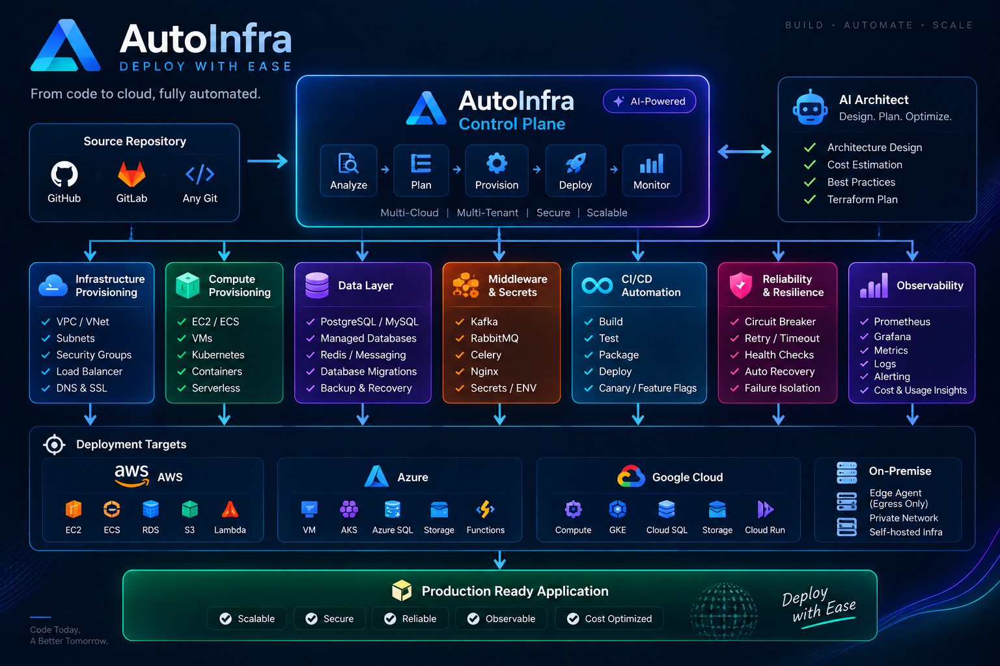
</p>

> **Repository → Analyze → Provision → Configure → Migrate → Build → Deploy → Monitor**

### Platform Flow

```mermaid
flowchart LR

    A["📦 SOURCE<br/>GitHub / GitLab"]
    B["🧠 AUTOINFRA<br/>Control Plane"]
    C["🏗️ INFRA<br/>Provisioning"]
    D["🗄️ DATA<br/>Provisioning"]
    E["⚙️ CI/CD<br/>Automation"]
    F["🚀 DEPLOY<br/>Workloads"]
    G["📊 OBSERVE<br/>Monitor"]

    A --> B
    B --> C
    C --> D
    D --> E
    E --> F
    F --> G

    style A fill:#24292f,color:#fff,stroke:#58a6ff
    style B fill:#2563eb,color:#fff,stroke:#60a5fa
    style C fill:#7c3aed,color:#fff,stroke:#a78bfa
    style D fill:#0891b2,color:#fff,stroke:#22d3ee
    style E fill:#ea580c,color:#fff,stroke:#fb923c
    style F fill:#16a34a,color:#fff,stroke:#4ade80
    style G fill:#db2777,color:#fff,stroke:#f472b6
```

---

## ☁️ Multi-Cloud Infrastructure

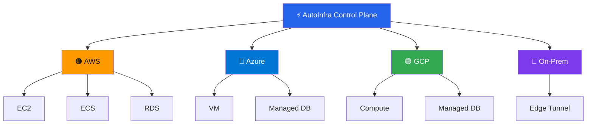

AutoInfra is **not limited to Kubernetes**. The platform can orchestrate different deployment models depending on workload requirements.

| Layer | Capabilities |
|---|---|
| ☁️ **Cloud** | AWS • Azure • GCP |
| 🖥️ **Compute** | EC2 • ECS • VMs • Containers • Serverless |
| 🌐 **Networking** | VPC/VNet • Subnets • Security Rules • Load Balancers |
| 🌍 **Routing** | DNS • SSL/TLS |
| 🗄️ **Database** | PostgreSQL • MySQL • Managed Databases |
| 🔄 **Migrations** | Application DB Migration Execution |
| 📡 **Middleware** | Redis • Kafka • RabbitMQ • Nginx |
| 🔐 **Configuration** | Secrets • Environment Variables |
| ⚙️ **CI/CD** | Build • Test • Package • Deploy |
| 🚦 **Delivery** | Standard • Canary • Feature Flags |
| 🛡️ **Reliability** | Circuit Breaker • Retry • Timeout |
| 📊 **Observability** | Prometheus • Grafana • Metrics |

---

## 🏢 Multi-Tenant SaaS Architecture

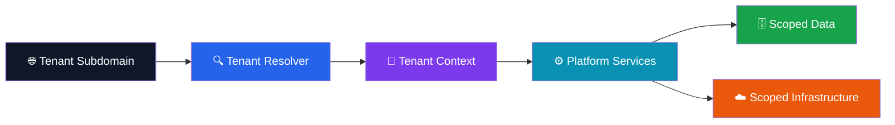

Each customer receives a unique tenant context. Backend operations, data access, and infrastructure workflows remain scoped to the resolved tenant.

---

## 🛡️ Circuit Breaker & Resilience

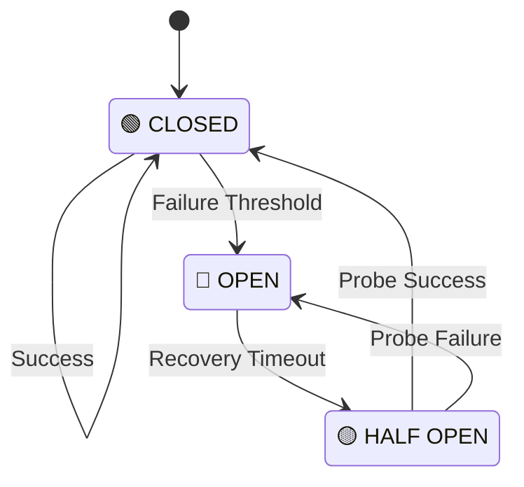

### Reliability Patterns

`Circuit Breaker` • `Retry` • `Timeout` • `Health Checks`  
`Failure Isolation` • `Graceful Degradation` • `Canary Rollouts`

---

## 🚦 Progressive Delivery

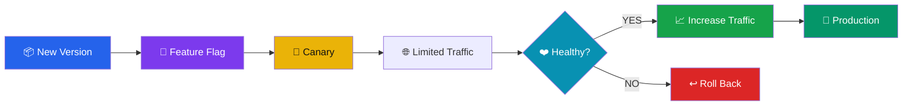

---

## 🏠 Edge Tunnel / On-Prem Agent

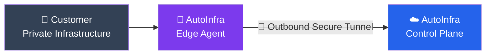

The customer-side agent establishes the outbound connection, avoiding the need to publicly expose private infrastructure.

---

## 🤖 AI Architect

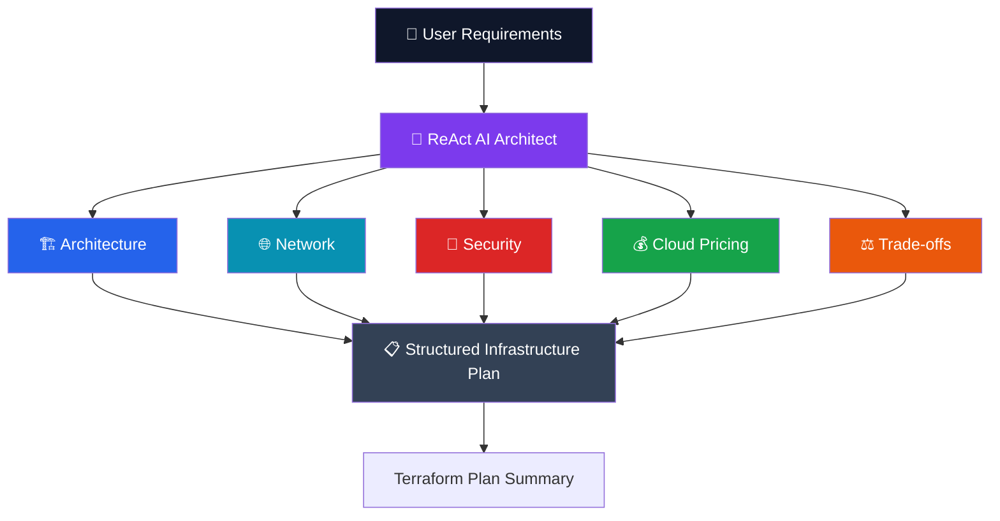

<div align="center">

<a href="https://autoinfra.in">

</a>

</div>

---

# 🏢 Production Engineering

## 🚀 BuildPiper — Multi-Tenant SaaS

Worked on transitioning BuildPiper toward a **multi-tenant B2B SaaS architecture**.

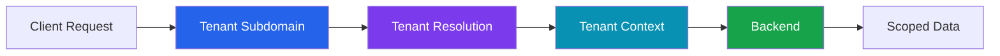

**Engineering:** `Tenant Isolation` • `Tenant-Aware Routing` • `Data Isolation` • `SAML SSO`

**Tech:** `Django` `PostgreSQL` `SAML` `Multi-Tenancy`

---

## 🔐 Enterprise SAML SSO

Implemented enterprise SAML authentication using ADFS.

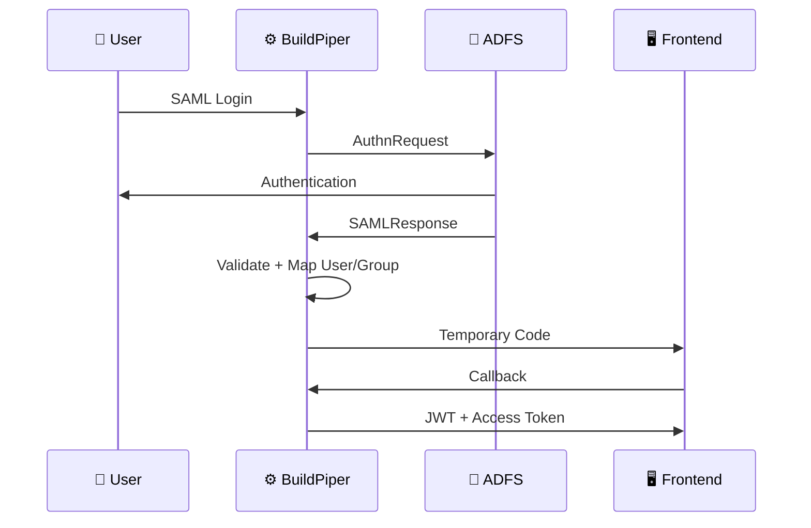

**Tech:** `Django` `SAML 2.0` `ADFS` `JWT` `RBAC`

---

## ⚡ Careers360 — High-Performance Backend

### Impact

<div align="center">

| ⚡ API Latency | 👥 Concurrent Users | 📝 Registrations |
|:---:|:---:|:---:|
| **~75% ↓** | **35K+** | **20K+** |
| ~200ms → ~50ms | JEE Main peak | Day-1 |

</div>

Optimized Signup/Login APIs using query optimization, Redis caching, and asynchronous processing.

**Tech:** `Python` `Django` `Redis` `MySQL` `ClickHouse` `Celery` `AWS`

---

## 🎯 Rank Prediction Engine

Built a predictive ranking engine for nationwide examinations.

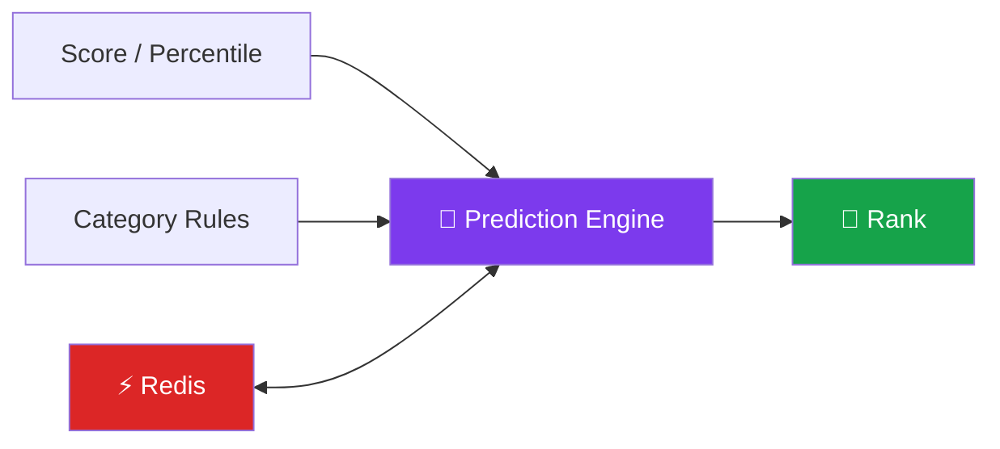

### Scale: **17,000+ users/hour**

Supported:

`JEE` • `NEET` • `GEN` • `OBC` • `PWD`

`Score → Rank` • `Percentile → Rank`

---

## 🎓 College Prediction System

Designed backend logic to match students to colleges using:

`Rank` • `Category` • `Exam` • `Reservation` • `Preferences`

Supported:

`JEE Main` • `WBJEE` • `COMEDK`

Used scalable schemas and Redis caching for filter-heavy searches.

---

## 💳 LUXASIA — Finance Reconciliation

Automated financial reconciliation across:

`Shopee` • `Lazada` • `TikTok` • `Amazon`

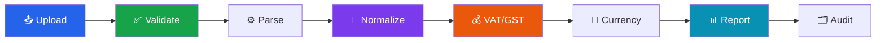

### Impact

> **20 days of manual processing across 4 analysts → near-instant processing**

**Tech:** `Python` `Django` `MSSQL` `Pandas` `OpenPyXL` `Docker` `Azure`

---

## 🧰 Olly — Production Log Analysis CLI

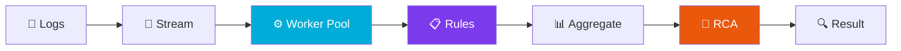

Built with:

`Go` • `Cobra` • `Goroutines` • `Channels` • `Context Cancellation` • `YAML`

Features bounded worker pools, streaming file processing, configurable rule detection, issue aggregation, and LLM-assisted root-cause analysis.

---

# 🧪 Engineering Projects

## 🛡️ SentryFuse — Secret Leak Detection


**Tech:** `Go` `Kafka` `GitHub Apps` `Slack` `PagerDuty`

---

## 🗄️ DB Governance

Proactively detects integer ID / auto-increment exhaustion across MySQL and PostgreSQL.

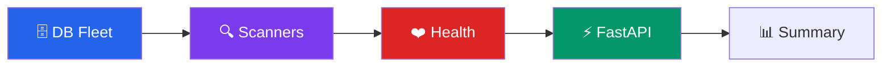

`Pluggable Scanners` • `Encrypted Credentials` • `Health Tiers` • `Scan Lifecycle`

**Tech:** `FastAPI` `SQLAlchemy 2.0` `PostgreSQL` `MySQL` `Alembic` `Docker`

---

## 💰 UnitEconPro — AWS FinOps

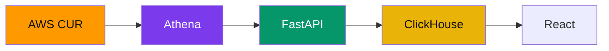

Cloud cost intelligence and infrastructure unit-economics platform.

**Tech:** `FastAPI` `ClickHouse` `AWS Athena` `CUR` `React` `Kubernetes` `Helm`

---

## 🤖 CodeLens — Automated PR Reviewer

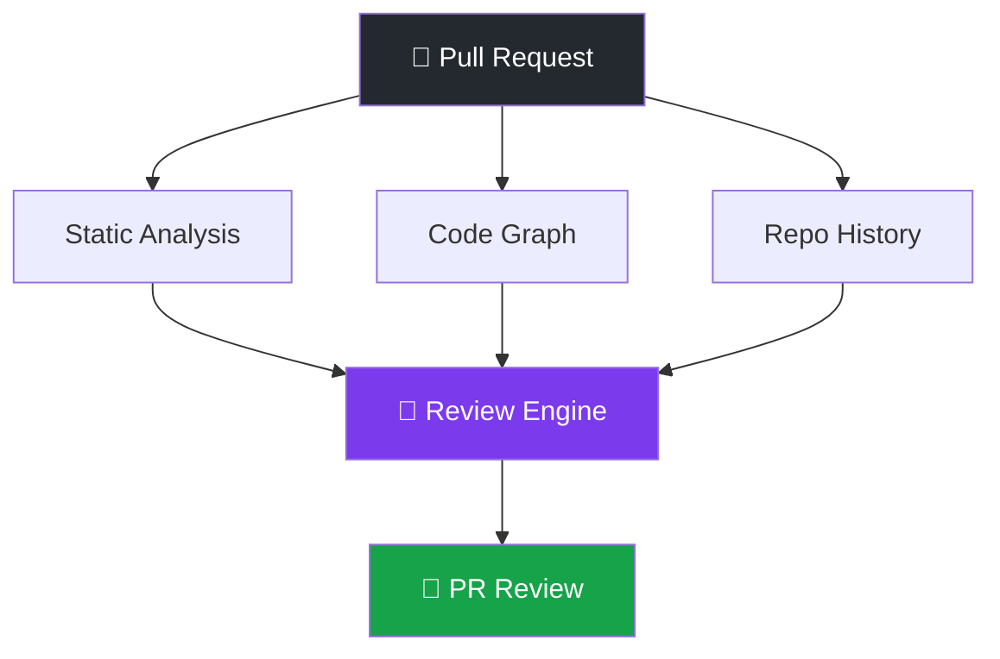

**Tech:** `Python` `FastAPI` `React` `GitHub`

---

## 🔐 SCIM 2.0 — Identity Provisioning

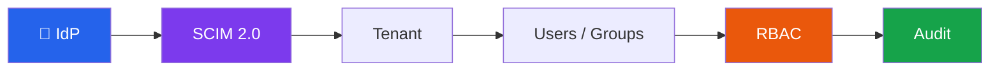

`Users` • `Groups` • `PATCH` • `Group → Role Mapping`  
`Multi-Tenant Isolation` • `Idempotency` • `Audit Logging`

---

## 📰 Real-Time Financial News Platform

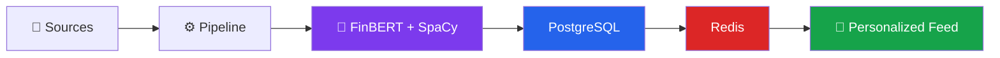

Built automated financial-news ingestion with sentiment classification, entity recognition, company/sector tagging, and personalized feeds.

**Tech:** `Django` `PostgreSQL` `FinBERT` `SpaCy` `Redis` `AWS`

---

## 🤖 AI Chatbot & SQL Intelligence

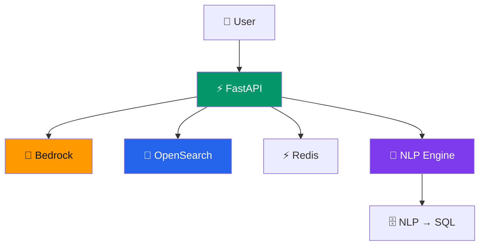

`RAG` • `Context Retrieval` • `WebSockets` • `NLP-to-SQL` • `Entity Extraction`

**Tech:** `Python` `FastAPI` `Amazon Bedrock` `OpenSearch` `Redis` `SpaCy` `DistilBERT`

---

## 🔐 User Management & Payments

Built backend capabilities including:

`OAuth2` • `JWT` • `2FA` • `Social Login`  
`Real-Time Notifications` • `Razorpay`

**Tech:** `Django REST Framework` `OAuth2` `JWT` `Firebase` `Razorpay`

---

# ⚙️ Systems & Reliability

<div align="center">

| 🛡️ Resilience | 🏗️ Architecture | 📡 Async | ⚡ Performance |
|---|---|---|---|
| Circuit Breaker | Microservices | Kafka | Redis Caching |
| Retry | Multi-Tenancy | Celery | Query Optimization |
| Timeout | Event-Driven | RabbitMQ | API Optimization |
| Fault Isolation | API Gateway | Goroutines | Async Processing |
| Graceful Failure | REST / WebSockets | Worker Pools | Rate Limiting |

</div>

---

# 📌 Recent GitHub Work

<div align="center">

<a href="https://github.com/rj62127/job-find-self">

</a>

<a href="https://github.com/rj62127/ai-agent-hub">

</a>

<a href="https://github.com/rj62127/python-genai-developer-assignment">

</a>

<a href="https://github.com/rj62127/lld">

</a>

</div>

---

# 📝 Engineering Notes

I write about engineering problems I've implemented or explored across backend systems, identity, infrastructure, distributed systems, and DevOps.

### 🔐 SCIM 2.0 — Identity Lifecycle Beyond SSO

`Multi-Tenancy` • `PATCH Semantics` • `Group Synchronization`  
`RBAC Mapping` • `Idempotency` • `Audit Logging`

### ☁️ AutoInfra — Infrastructure Automation

`Multi-Cloud` • `Infrastructure Provisioning` • `Deployment Automation`  
`Circuit Breakers` • `Progressive Delivery` • `Platform Engineering`

### 🗄️ Database Governance

`PostgreSQL` • `MySQL` • `ID Exhaustion`  
`Monitoring` • `Health Aggregation` • `FastAPI`

### 🔐 Enterprise Identity

`SAML` • `ADFS` • `OAuth2` • `OIDC` • `SCIM` • `RBAC`

### ⚙️ Distributed Systems

`Kafka` • `Worker Pools` • `Goroutines` • `Async Processing`  
`Retries` • `Timeouts` • `Fault Tolerance`

<div align="center">

<a href="https://www.linkedin.com/in/rajan62127/">

</a>

</div>

---


# 🌍 Global Time

<!-- GLOBAL-TIME:START -->

| 🇮🇳 India | 🇬🇧 London | 🇺🇸 New York | 🇺🇸 San Francisco |
|:---:|:---:|:---:|:---:|
| **10:58 PM IST** | **6:28 PM** | **1:28 PM** | **10:28 AM** |

| 🇦🇪 Dubai | 🇸🇬 Singapore | 🇦🇺 Sydney |
|:---:|:---:|:---:|
| **9:28 PM GST** | **1:28 AM SGT** | **3:28 AM** |

<!-- GLOBAL-TIME:END -->


---

# 💭 Thought of the Day

<!-- DAILY-THOUGHT:START -->

> ### “Great systems aren't defined by how they behave when everything works, but by how gracefully they behave when something fails.”

<!-- DAILY-THOUGHT:END -->

<p align="center">
<i>☀️ Automatically refreshed every day</i>
</p>

---

<div align="center">

## Build • Automate • Scale

**Backend Engineering • Distributed Systems • Platform Engineering • Cloud Infrastructure**

<br/><br/>

<a href="https://autoinfra.in">

</a>

<a href="https://www.linkedin.com/in/rajan62127/">

</a>

<br/><br/>

### Build reliable systems. Automate infrastructure. Scale with confidence.

</div>
